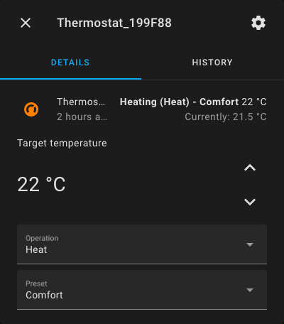

# Home Assistant integration for Scinan Thermostats

Custom component to support Scinan Thermostats.

## Supported devices

Supports WiFi Thermostats using the Scinan API https://api.scinan.com.

Should support thermostats using an application created
by [Saswell](https://play.google.com/store/apps/developer?id=saswell).

Known supported devices:

- Saswell SAS920FHL-7W-WIFI
- Prosmart PST50W

_Only supports devices already connected to WiFi. Refer to thermostat instruction manuel on how to connect to WiFi._

## Installation

Installed through [HACS](https://hacs.xyz/).

`Start HACS -> Integrations -> Overflow menu -> Custom repositories`

Add `https://github.com/skarbo/hass-scinan-thermostat` as repository in `Repository` field.
Select `Integration` as `Category`.

`Scinan Thermostat` is now displayed in HACS integrations. Select it and press `Download this repository with HACS`.

Restart Home Assistant.

_Will be added as a default HACS integration later on._

## Configuration

Add integration in Home Assistant.

`Settings -> Integrations -> Add integration -> Search "Scinan Thermostat" -> Select`

Enter email and password used for controlling your thermostats.

Each thermostat registered to your account will be added as
a [Climate entity](https://www.home-assistant.io/integrations/climate/).

## Supported features

- Change temperature
- HVAC mode: Heat / Off
- Preset: Auto / Comfort / Day or night

_Turning off device is not supported by API, will be set as Away when using HVAC Off._

### Schedule / program

Changing thermostat program is not supported. Use a schedule integration
(ie. [scheduler-card](https://github.com/nielsfaber/scheduler-card)) instead.

_Set devices to Comfort mode when controlled by a schedule._

## Inspiration

- [com.scinan.api](https://github.com/PetterRuud/com.scinan.api/) Scinan controllers for Homey
- [node-red-contrib-scinan](https://github.com/lodegaard/node-red-contrib-scinan) Scinan integration for Node Red
- [HAExtra](https://github.com/hdcola/HAExtra/blob/master/custom_components/climate/saswell.py) Saswell climate
  integration
- [home-assistant](https://github.com/home-assistant/core/tree/dev/homeassistant/components/mill) Mill climate
  integration