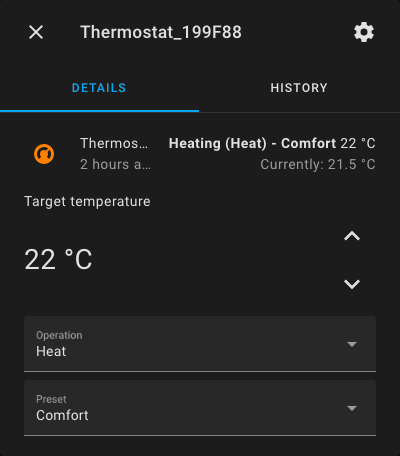

# Home Assistant integration for Scinan Saswell Thermostats

Custom component to support Scinan Saswell Thermostats.

## Supported devices

Supports WiFi Thermostats using the Scinan API https://api.scinan.com or Saswell API http://api.saswell.com.cn.

Should support thermostats using an application created
by [Saswell](https://play.google.com/store/apps/developer?id=saswell).

Known supported devices:

- Saswell SAS920FHL-7W-WIFI
- Saswell SAS922WHL-7W-S-WIFI
- Prosmart PST50W

_Only supports devices already connected to WiFi. Refer to thermostat instruction manuel on how to connect to WiFi._

## Installation

Installed through [HACS](https://hacs.xyz/).

### Install using HACS

`Start HACS -> Integrations -> Explore & download repositories -> Search for "Scinan Saswell Thermostat" -> Install`

`Scinan Saswell Thermostat` is now displayed in HACS integrations.

Restart Home Assistant.

### Install manually

`Start HACS -> Integrations -> Overflow menu -> Custom repositories`

Add `https://github.com/skarbo/hass-scinan-thermostat` as repository in `Repository` field.
Select `Integration` as `Category`.

`Scinan Saswell Thermostat` is now displayed in HACS integrations. Select it and press `Download this repository with HACS`.

Restart Home Assistant.

## Configuration

Add integration in Home Assistant after completed installation.

`Settings -> Integrations -> Add integration -> Search "Scinan Saswell Thermostat" -> Select`

Enter email and password used for controlling your thermostats.

Each thermostat registered to your account will be added as
a [Climate entity](https://www.home-assistant.io/integrations/climate/).

## Supported features

- Change temperature
- HVAC mode: Heat / Off
- Preset: Auto / Comfort / Day or night

_Turning off device is not supported by API, will be set as Away when using HVAC Off._

### Schedule / program

Changing thermostat program is not supported. Use a schedule integration
(ie. [scheduler-card](https://github.com/nielsfaber/scheduler-card)) instead.

_Set devices to Comfort mode when controlled by a schedule._

## Inspiration

- [com.scinan.api](https://github.com/PetterRuud/com.scinan.api/) Scinan controllers for Homey
- [node-red-contrib-scinan](https://github.com/lodegaard/node-red-contrib-scinan) Scinan integration for Node Red
- [HAExtra](https://github.com/hdcola/HAExtra/blob/master/custom_components/climate/saswell.py) Saswell climate
  integration
- [home-assistant](https://github.com/home-assistant/core/tree/dev/homeassistant/components/mill) Mill climate
  integration

## Troubleshooting

If you have authentication problems or unavailable entities, check that your account is active in your Thermostat app.

If there are still authentication problems in your integration, delete and re-install the Scinan Saswell Thermostat integration.

If you are still experiencing problems, check the logs and create an [issue](https://github.com/Skarbo/hass-scinan-thermostat/issues).

## Changes

### v1.1.0

As of April 2023 all the Saswell Thermostat apps changed their API from Scinan v1.0 (https://api.scinan.com) to Saswell v2.0 (http://api.saswell.com.cn). Accounts may need to be re-activated in the Thermostat app and devices re-connected. 

The integration has been updated to use Saswell v2.0 API by default. User will be prompted to re-authenticate if the account is not active with Saswell v2.0 API.

Use Advanced Mode to select between v1.0/v2.0 and Scinan/Saswell APIs.
